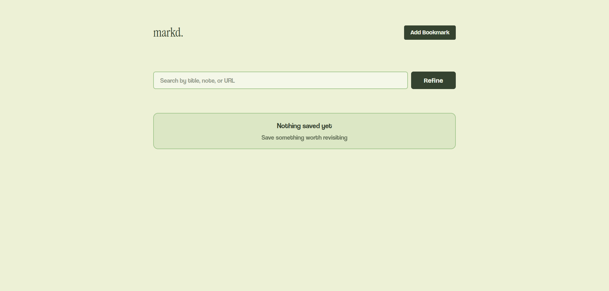

# Markd

> **Context-driven knowledge bookmarking.**

Markd is a context-driven knowledge bookmarking application built to solve the "save and forget" problem. Unlike traditional bookmark managers that store links and titles, Markd preserves the intent behind every saved resource, turning bookmarks into searchable, reusable knowledge. Markd began as a local-first MVP and has since evolved into a full-stack MERN application with user accounts and persistent, cross-device storage.

<p align="center">
  <a href="https://markdhq.vercel.app"><strong>Live Demo</strong></a>
</p>

## Preview

<p align="center">
  
</p>

## Overview

Browser bookmarks are designed to save links.

Markd is designed to preserve knowledge.

Traditional bookmarking systems store a URL and page title, but rarely the reason the resource was worth saving. As collections grow, users remember *why* they saved something rather than the website itself.

Markd addresses this by treating every bookmark as a knowledge object that combines a resource with personal context, making retrieval faster, organization simpler, and collections easier to maintain. With a dedicated backend and database, that knowledge base is now tied to a user account and available from any device.

## Core Capabilities

### User Authentication

Accounts are secured with hashed passwords and token-based authentication. Protected routes ensure that a user's bookmarks are only ever accessible to them, on the frontend and the backend.

### Contextual Bookmarking

Each bookmark stores structured metadata alongside the resource.

* URL
* Title
* Personal note
* Tag
* Visit count
* Creation timestamp

Capturing intent ensures resources remain meaningful long after they are saved.

### Contextual Search

Search operates across multiple fields simultaneously.

* Title
* URL
* Personal notes

Users can retrieve resources using remembered context rather than exact page titles or domains.

### Lightweight Organization

Flat tags replace nested folder hierarchies, reducing organizational overhead while keeping resources easy to categorize and refine.

### Usage Tracking

Visit counts are updated automatically whenever a bookmark is opened, providing a simple signal for distinguishing frequently referenced resources from forgotten ones.

### Persistent, Cross-Device Storage

Bookmarks are stored in MongoDB and served through a REST API, replacing the original LocalStorage-only implementation. Data now persists across sessions, browsers, and devices.

## Technical Highlights

* Full MERN stack: MongoDB, Express, React, Node.js
* JWT-based authentication with protected API routes
* Password hashing for secure credential storage
* RESTful API with clear separation between routes, controllers, and models
* Client-side route protection for authenticated pages
* Component-based React architecture
* Real-time search and filtering
* Responsive card-based interface
* Single-source application state

## Architecture

```text
                     User Interaction
                            │
                            ▼
                     React Frontend
                            │
          ┌─────────────────┼─────────────────┐
          ▼                 ▼                  ▼
   Auth Pages          Bookmark UI        Protected Routes
 (Login/Register)  (Create/Search/Manage)   (Client Guard)
          └─────────────────┬─────────────────┘
                            ▼
                    REST API (Express)
                            │
                ┌───────────┴───────────┐
                ▼                       ▼
         Auth Middleware          Controllers
        (JWT Verification)   (Auth / Bookmarks)
                └───────────┬───────────┘
                            ▼
                    Mongoose Models
                            │
                            ▼
                        MongoDB
```

## Technology

### Frontend

| Technology         | Purpose                  |
| ------------------ | ------------------------- |
| React               | User Interface            |
| React Router        | Client-side Routing        |
| JavaScript (ES6+)   | Application Logic         |
| Tailwind CSS        | Utility-first Styling     |
| Vite                | Development Environment   |

### Backend

| Technology  | Purpose                       |
| ----------- | ------------------------------ |
| Node.js     | Runtime Environment             |
| Express     | REST API Framework              |
| MongoDB     | Data Persistence                |
| Mongoose    | Object Data Modeling            |
| JWT         | Authentication Tokens           |
| bcrypt      | Password Hashing                |

## Project Structure

```text
backend/
├── config/
│   └── db.js
├── controllers/
│   ├── authController.js
│   └── bookmarkController.js
├── middleware/
│   └── authMiddleware.js
├── models/
│   ├── bookmark.js
│   └── user.js
├── routes/
│   ├── authRoutes.js
│   └── bookmarkRoutes.js
├── .env
├── app.js
└── server.js

frontend/
├── src/
│   ├── components/
│   │   ├── AddBookmark.jsx
│   │   ├── BookmarkCard.jsx
│   │   ├── BookmarkGrid.jsx
│   │   ├── Header.jsx
│   │   ├── Refine.jsx
│   │   ├── SearchBar.jsx
│   │   └── StateMessage.jsx
│   ├── pages/
│   │   ├── Login.jsx
│   │   ├── ProtectedRoute.jsx
│   │   └── Register.jsx
│   ├── App.jsx
│   ├── index.css
│   └── main.jsx
├── index.html
└── vite.config.js
```

## Running Locally

Clone the repository.

```bash
git clone https://github.com/vbyte-dev/markd.git
```

### Backend Setup

```bash
cd backend
npm install
```

Create a `.env` file in the `backend` directory with the following variables.

```text
MONGO_URI=your_mongodb_connection_string
JWT_SECRET=your_jwt_secret
PORT=5000
```

Start the API server.

```bash
npm run dev
```

### Frontend Setup

```bash
cd frontend
npm install
npm run dev
```

The frontend expects the backend API to be running and reachable; update the API base URL in the frontend configuration if the backend is hosted elsewhere.

## Design Decisions

### Preserve Context

Bookmarks should capture why a resource matters rather than only where it is located.

### Reduce Organizational Friction

Flat tags eliminate the maintenance burden associated with nested folder structures.

### Prioritize Retrieval

Information should be discoverable through memory and context instead of navigation alone.

### Usage-aware Knowledge

Bookmarks automatically track visits, providing lightweight usage signals that help distinguish frequently referenced resources from forgotten ones.

### Own Your Data, Anywhere

Moving from LocalStorage to a proper backend keeps the same local-first simplicity for the user while adding accounts, persistence, and access from any device.

## Current Scope

The application implements the complete bookmarking workflow on a full-stack foundation.

* User registration and login
* Token-based authentication
* Protected routes on client and server
* Create, edit, and delete bookmarks
* Contextual notes
* Live search
* Tag refinement
* Usage tracking
* Responsive interface
* Persistent, cross-device storage

## Future Work

- Browser extension
- Import and export
- AI-powered semantic search
- AI-generated bookmark summaries
- Smart tag suggestions
- Related bookmark recommendations
- Duplicate detection
- Dead link validation

## License

This project is licensed under the MIT License.
